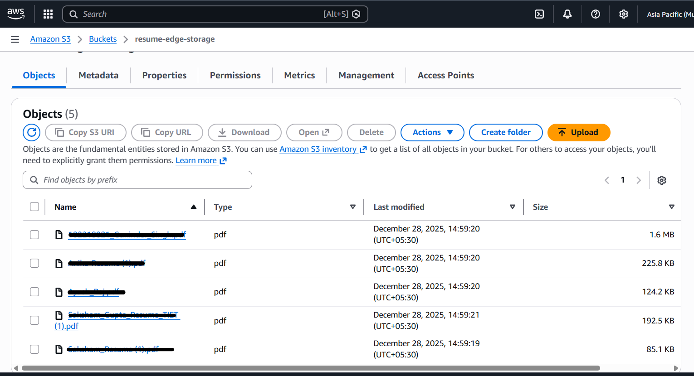

# ResumeEdge: AI-Powered Professional Resume Builder

**ResumeEdge** is a production-grade **MERN stack application** designed to simplify and enhance the resume creation process. The project demonstrates **full-stack engineering, containerization, cloud infrastructure, and CI/CD automation**, deployed on AWS with a real-world DevOps workflow.

---

## 📸 Demo & Deployment Gallery

This section provides **visual proof of deployment, automation, and system architecture**.

---

## 🌐 Live Application Walkthrough

🎥 **Live Resume Builder & Dashboard Demo**  
🔗 [Watch Live Application Demo](https://github.com/user-attachments/assets/638a4342-ec7e-421d-9ee5-ee2d8646d9a0)

<p align="center">
  
</p>

---

## 🔁 Automated CI/CD Pipeline (GitHub Actions → AWS EC2)

🎥 **CI/CD Deployment Video**  
🔗 [Watch CI/CD Pipeline Demo](https://github.com/user-attachments/assets/1f76486b-402e-4dc7-9f99-cece161c921e)

<p align="center">
  
</p>

---

## 🏗 Project Architecture & CI/CD Flow

<p align="center">
  
</p>

---

## ☁️ AWS S3 Storage Integration

<p align="center">
  
</p>

---

## ✨ Features

- **Interactive Resume Builder** – Real-time resume creation with structured sections and templates  
- **AI-Driven Resume Analysis** – Automated analysis to assist users in improving resume content  
- **Cloud Asset Storage** – Secure handling of images and PDF resumes using AWS S3  
- **Persistent Data Management** – MongoDB for storing user profiles and resume metadata  
- **Fully Dockerized** – Multi-container architecture using Docker Compose  
- **Automated CI/CD Pipeline** – Zero-manual deployment using GitHub Actions and AWS EC2  

---

## 🧰 Technology Stack

### Frontend
- React.js
- Vite
- Tailwind CSS

### Backend
- Node.js
- Express.js

### Database
- MongoDB

### Cloud & DevOps
- AWS EC2 (Hosting)
- AWS S3 (Storage)
- Docker & Docker Compose
- GitHub Actions (CI/CD)

---

## 🚀 Infrastructure & Deployment

The application is deployed on an **AWS EC2 (t2.micro)** instance.

- Docker isolates the frontend, backend API, and database  
- GitHub Actions handles automated builds and deployments  
- AWS S3 ensures scalable and durable file storage  

---

## 🔄 CI/CD Workflow

On every push to the `main` branch:

1. GitHub Actions establishes an SSH connection to EC2  
2. Latest code is pulled from the repository  
3. Docker images are rebuilt using Docker Compose  
4. Containers restart with updated application code  

---

## ▶️ How to Run This Project

### Option 1: Local Development

```bash
git clone -b pre-cicd-archive https://github.com/yourusername/ResumeEdge.git
cd ResumeEdge
```

**Backend**
```bash
cd server
npm install
npm start
```

**Frontend**
```bash
cd client
npm install
npm run dev
```

Create a `.env` file in `server/`:

```env
PORT=3000
MONGO_URI=your_mongodb_connection_string
JWT_SECRET=your_secret_key
AWS_ACCESS_KEY_ID=your_key
AWS_SECRET_ACCESS_KEY=your_secret
S3_BUCKET_NAME=your_bucket
```

---

### Option 2: Full Cloud Deployment with CI/CD

```bash
git clone https://github.com/yourusername/ResumeEdge.git
docker compose up -d --build
```

**AWS Setup**
- EC2 (Ubuntu t2.micro)
- Open ports: `80`, `3000`, `5173`
- S3 bucket with public access enabled
- IAM user with `AmazonS3FullAccess`

**GitHub Secrets**
- `EC2_HOST`
- `EC2_USER`
- `EC2_SSH_KEY`
- `ENV_FILE`

Push to deploy:
```bash
git push origin main
```

---

## 🛠 Troubleshooting

| Issue | Cause | Solution |
|-----|------|---------|
| Connection timeout | Security Group | Open ports 3000 & 5173 |
| S3 upload error | Missing env var | Set `S3_BUCKET_NAME` |
| Changes not visible | Docker cache | Rebuild with `--build` |
| EC2 freezes | Low RAM | Enable swap memory |
| Module not found | Case mismatch | Match file names exactly |

---

## 🧹 Maintenance

```bash
docker system prune -a --volumes -f
```

---

## 📄 License

This project is for **educational purposes**.  
Feel free to clone, modify, and extend it.
